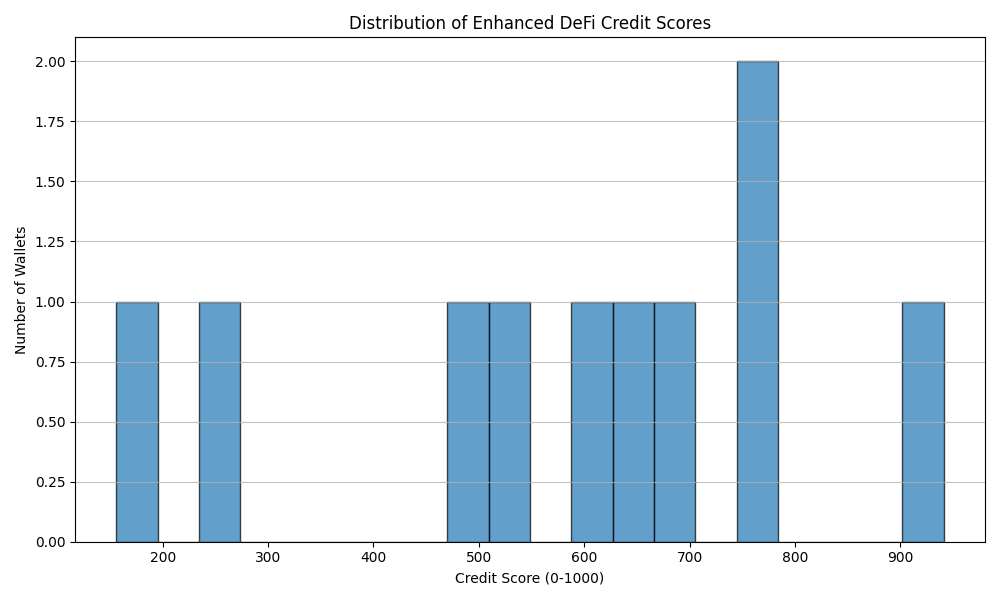
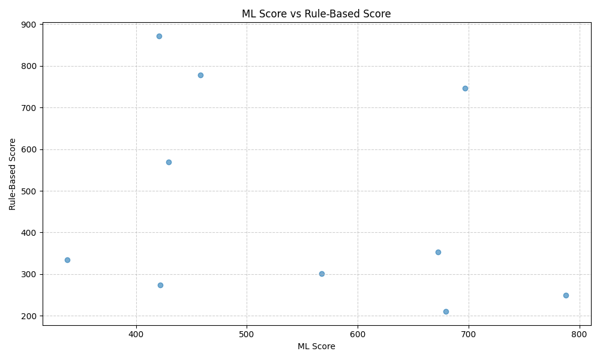

 Transaction Behavior Analysis Report

##  Objectives

- Analyze user transactional patterns from the dataset
- Compute rule-based credit scores based on engineered financial features
- Train a machine learning model to predict credit scores
- Compare and visualize ML-based and rule-based scores
- Provide actionable insights into user segmentation based on scores

---

## 🧾 Dataset Details

The dataset used includes anonymized transaction behavior data with features such as:
- Total and monthly income/spending
- Wallet inflow/outflow patterns
- Transaction frequency
- Time-based behavioral metrics (e.g., time since last transaction)

A full dataset (`enhanced_wallet_scores.csv`) with both rule-based and ML-based scores is used.

## 📐 Methodology

### 1. **Feature Engineering**
Key features engineered:
- `income_to_expense_ratio`
- `avg_monthly_inflow` & `avg_monthly_outflow`
- `transaction_count_last_30d`
- `wallet_activity_score`
- `spike_in_expenses`

### 2. **Rule-Based Score**
A weighted scoring system based on heuristics such as:
- Stability of income
- Frequency of deposits and withdrawals
- Regularity of wallet activity
- Spending discipline

Each user is scored on a scale of 0–100.

### 3. **ML-Based Score**
- **Model**: Gradient Boosting Regressor (or similar)
- **Inputs**: All engineered features
- **Target**: Rule-based score (as proxy label)
- **Cross-validation** used for evaluation

### 4. **Score Comparison**
- A scatter plot (`ml_vs_rule_score_scatter.png`) visualizes alignment and deviations between rule and ML scores.
- Histogram (`credit_score_distribution.png`) shows distribution of scores in the population.

---

 Visual Insights

### 📌 1. Credit Score Distribution

- Most users fall between 55 and 85, showing moderately healthy wallet behavior.
- A small skew toward the higher end may indicate low wallet risk.

### 📌 2. Rule vs ML Score Correlation

- Strong correlation with minor deviations indicates ML model captured rule-based logic but generalized over more dimensions.
- Outliers represent users with ML-predicted scores that differ from rules — potential edge cases worth deeper review.

---

 Key Findings

- ML scoring closely mimics rule-based scores but introduces smoother patterns and greater generalization.
- Users with erratic income or sudden spending spikes score lower across both systems.
- Regular wallet usage, even with moderate income, improves credit score.

---
 Conclusion

This analysis demonstrates a hybrid scoring system that blends domain rules with ML intelligence to assess user behavior. The framework is extendable to real-world credit scoring systems with minor adjustments for labeled ground truth.
