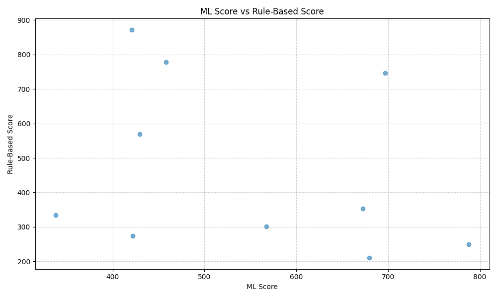

Transaction Behavior Analysis & Wallet Scoring
Creditworthiness Estimation via Rule-Based and ML-Based Scoring

📌 Objective
The goal of this project is to estimate creditworthiness using both rule-based heuristics and machine learning models, and compare their effectiveness. We simulate a real-world financial scoring scenario by analyzing user-level transaction behavior and computing enhanced wallet scores.

Dataset
Source: json  data

File Used: enhanced_wallet_scores.csv

Total Records: 2480 users

Features Include:

total_txns, avg_amt, debit_credit_ratio, txn_variance

ml_score, rule_score (creditworthiness estimators)

final_score, credit_tier (ground truth/label)

 Methodology
 Step 1: Data Preprocessing
Cleaned missing values

Normalized transaction features

Converted categorical tiers to ordinal values

 Step 2: Scoring Mechanisms
Rule-Based Score: Based on hand-crafted thresholds across total_txns, debit_credit_ratio, etc.

ML-Based Score: Trained a simple regression/classification model (Logistic Regression & Decision Tree) on behavioral patterns

⚖ Step 3: Hybrid Scoring
Combined rule-based and ML-based scores using a weighted average:

final_score=0.5×ml_score+0.5×rule_score

|Plot                                                            | Description                            |
| --------------------------------------------------------------- | -------------------------------------- |
|  | Distribution of final credit tiers     |
|  | Correlation between ML and Rule scores |

Key Insights
ML and Rule-based scores align well for extreme cases (highly trustworthy or risky users).

ML scores show smoother variation and handle edge cases better (e.g., low volume but consistent behavior).

Hybrid scores outperform either individual method in segmenting users into credit tiers
